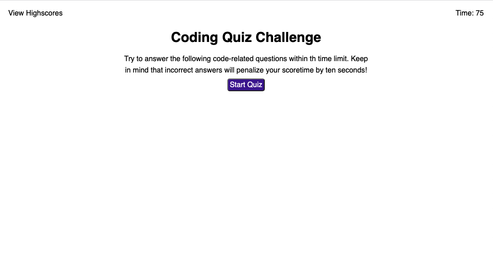
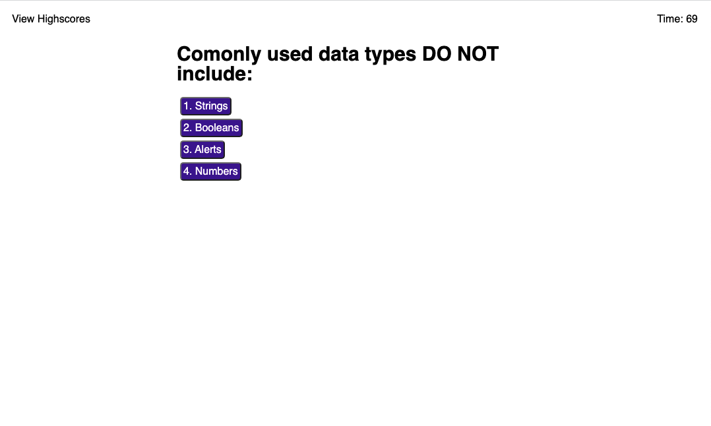
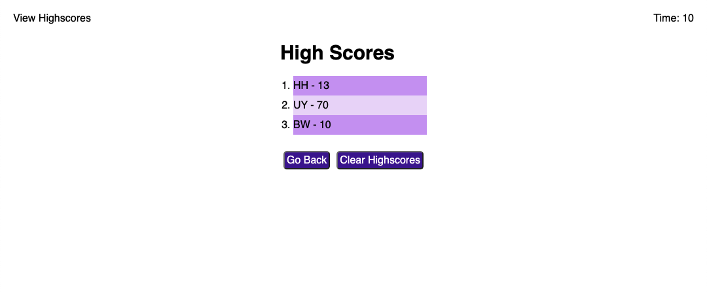

# coding-quiz

##  Description
The purpose of this repository is to create an interactive coding quiz on JavaScript, using primarily JavaScript. 

The quiz takes the form of a 5 multiple choice timed questions, with a 20 second time penalty for an incorrect answer. 

The code also utilizes the users local storage to store to highscores. 

## Installation
N/A

## Usage
Deployed website can be viewed [here.](https://braddwagner.github.io/coding-quiz/)
To begin the quiz simply select the Start Quiz button and answer the questions by selecting the corresponding buttons. Once all questions have been answered or time has run out you will be able to enter your initials and submit your highscore. Highscores can be viewed at any time by selecting the button form the top left. 

## Credits
N/A

## License
Please refer to the LICENSE in the repo.